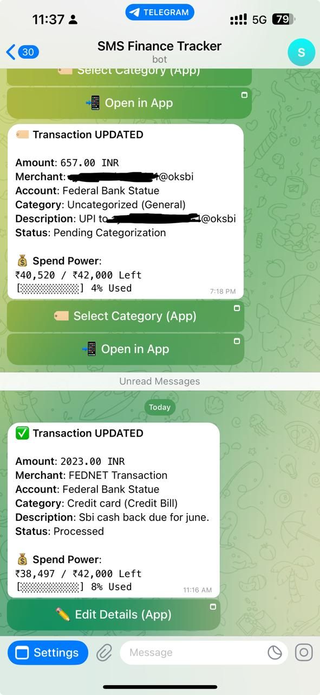
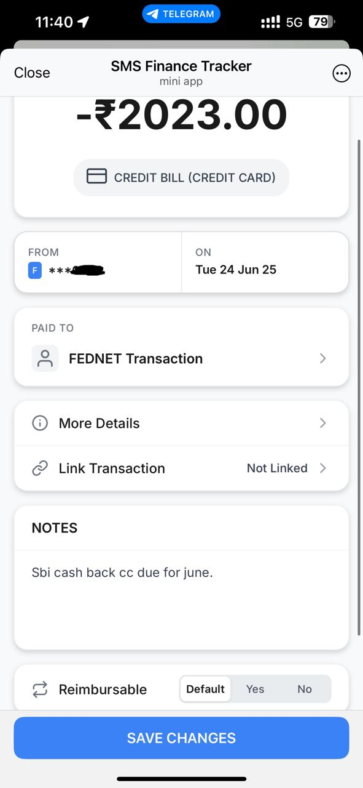
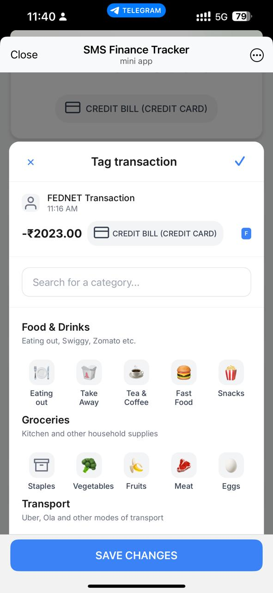
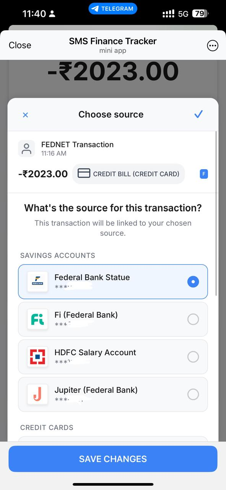
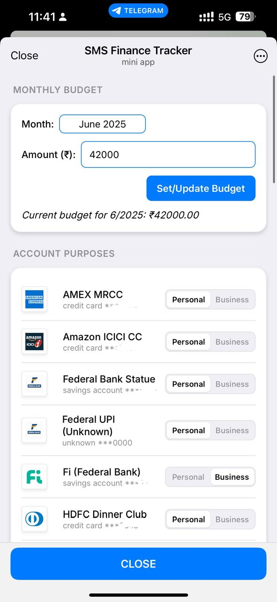

# SMS Finance Tracker

[](https://python.org)
[](https://fastapi.tiangolo.com)
[](https://sqlite.org)
[](https://telegram.org)

A smart personal finance tracker that automatically parses SMS notifications from Indian banks and provides real-time expense tracking through a Telegram bot interface.

> **⚠️ Project Status**: This project is currently in development and not yet feature-complete. Core functionality is working but some features are still being implemented.

## 📱 Screenshots

| Main Interface | Transaction Details | Category Selection | Accounts | Settings |
|----------------|---------------------|-------------------|----------|----------|
|  |  |  |  |  |


## ✨ Current Features

### 🏦 Multi-Bank SMS Parsing
- **Supported Banks**: HDFC, ICICI, SBI, Federal Bank, IDFC First Bank, AMEX
- **Transaction Types**: Card payments, UPI transfers, Net banking
- **Smart Detection**: Automatically identifies debit transactions and ignores credits
- **Duplicate Prevention**: Unique hash-based transaction deduplication

### 🤖 Telegram Bot Integration
- **Real-time Notifications**: Instant alerts for new transactions
- **Interactive Buttons**: Quick account and category selection via inline keyboards
- **Budget Tracking**: Live spend power updates with progress visualization
- **Mini App Interface**: Rich web-based transaction editing experience

### 📊 Comprehensive Categorization
- **Pre-built Categories**: 29 main categories with 109+ subcategories
- **Smart Icons**: Emoji and Feather icon support for visual categorization
- **Search & Filter**: Quick category finding with intelligent search
- **Rule Engine**: Automatic categorization based on merchant patterns

### 💰 Budget Management
- **Monthly Budgets**: Set and track monthly spending limits
- **Real-time Tracking**: Live budget vs. actual spending comparisons
- **Visual Progress**: Progress bars showing budget utilization
- **Smart Exclusions**: Configurable budget exclusions for transfers and reimbursables

### 🔗 Transaction Linking
- **Transfer Matching**: Link related transactions (e.g., credit card payments)
- **Budget Neutrality**: Linked transactions excluded from budget calculations
- **Visual Indicators**: Clear linking status in transaction lists

### ⚙️ Account Management
- **Multi-Account Support**: Track multiple bank accounts and cards
- **Account Types**: Savings, Credit Cards, Wallets, Cash
- **Purpose Classification**: Personal vs Business account segregation
- **Auto-Discovery**: Automatic account creation from SMS parsing

### 🏷️ Advanced Tagging
- **Reimbursable Tracking**: Mark transactions as reimbursable
- **Override Controls**: Manual override of automatic categorization
- **Flexible Rules**: Subcategory-level and transaction-level controls

## 🏗️ Architecture

### Backend Stack
- **Framework**: FastAPI with async support
- **Database**: SQLite with Alembic migrations
- **Authentication**: JWT-based token authentication for Mini App
- **API Design**: RESTful endpoints with comprehensive CRUD operations

### Frontend Stack
- **Telegram Mini App**: Pure JavaScript with modern ES6+
- **Styling**: Custom CSS with Telegram theme integration
- **Icons**: Feather Icons + Custom SVG bank logos
- **Responsive**: Mobile-first design optimized for Telegram

### Database Schema
- **Transactions**: Core transaction data with parsed SMS content
- **Categories/Subcategories**: Hierarchical categorization system
- **Accounts**: Bank account and card management
- **Budgets**: Monthly budget tracking
- **Rules**: Automatic categorization rules

## 🚀 Getting Started

### Prerequisites
- Python 3.8 or higher
- SQLite 3
- Telegram Bot Token
- iOS device with Shortcuts app (for SMS forwarding)

### Installation

1. **Clone the repository**
   ```bash
   git clone https://github.com/yourusername/sms-finance-tracker.git
   cd sms-finance-tracker
   ```

2. **Create virtual environment**
   ```bash
   python -m venv venv
   source venv/bin/activate  # On Windows: venv\Scripts\activate
   ```

3. **Install dependencies**
   ```bash
   pip install -r requirements.txt
   ```

4. **Environment Configuration**
   Create a `.env` file in the root directory:
   ```env
   # Database
   SQLALCHEMY_DATABASE_URL=sqlite:///./finance_tracker.db
   
   # Security
   APP_SECRET_KEY=your-secret-key-here # generate one using openssl rand -base64 32
   IPHONE_SHORTCUT_API_KEY=your-api-key-here # generate one using openssl rand -base64 32
   
   # Telegram Bot
   TELEGRAM_BOT_TOKEN=your-bot-token-here
   TELEGRAM_CHAT_ID=your-chat-id-here
   
   # Mini App
   MINI_APP_BASE_URL=https://your-domain.com/mini-app
   TOKEN_ALGORITHM=HS256
   ```

5. **Database Setup**
   ```bash
   # Run migrations
   alembic upgrade head
   ```

6. **Start the server**
   ```bash
   uvicorn app.main:app --reload --host 0.0.0.0 --port 8000
   ```

### Telegram Bot Setup

1. **Create a Telegram Bot**
   - Message [@BotFather](https://t.me/botfather) on Telegram
   - Use `/newbot` command and follow instructions
   - Copy the bot token to your `.env` file

2. **Set Webhook** (for production)
   ```bash
   curl -X POST "https://api.telegram.org/bot<YOUR_BOT_TOKEN>/setWebhook" \
        -H "Content-Type: application/json" \
        -d '{"url":"https://your-domain.com/api/v1/telegram/webhook"}'
   ```

### iOS Shortcuts Setup

1. **Download the Shortcut**
   <!-- Uploading Soon -->
   
2. **Configure API Endpoint**
   - Update the shortcut with your server URL
   - Add your API key for authentication

3. **Enable SMS Automation**
   - Set up automation to trigger on SMS from bank numbers
   - Configure to run the shortcut automatically

## 📡 API Documentation

Once the server is running, visit:
- **Interactive API Docs**: `http://localhost:8000/docs`
- **OpenAPI Schema**: `http://localhost:8000/openapi.json`

### Key Endpoints

```
POST /api/v1/transactions/          # Receive SMS content
GET  /api/v1/transactions/list      # List all transactions
PATCH /api/v1/transactions/{hash}   # Update transaction

GET  /api/v1/categories/all_details # Get categories with subcategories
GET  /api/v1/accounts/              # List accounts
POST /api/v1/accounts/              # Create new account

POST /api/v1/budget/                # Set monthly budget
GET  /api/v1/budget/summary         # Get current budget status
```

## 🏦 Supported Banks & SMS Formats

### Fully Supported
- **HDFC Bank**: Cards, UPI, Net Banking
- **ICICI Bank**: Credit/Debit Cards
- **SBI**: Credit Cards
- **Federal Bank**: UPI, Net Banking (FEDNET)
- **IDFC First Bank**: Credit Cards
- **American Express**: Credit Cards

### Adding New Banks
To add support for a new bank, create a parser in `app/services/parsers/`:

```python
from .base_parser import BaseParser

class YourBankParser(BaseParser):
    bank_name = "Your Bank"
    
    def parse(self, sms_text: str) -> Optional[Dict[str, Any]]:
        # Implement SMS parsing logic
        pattern = re.compile(r"your-regex-pattern")
        # ... parsing logic
        return parsed_data
```

## 🔧 Configuration

### Bank SMS Number Filtering
Configure your iOS Shortcuts to only process SMS from these numbers:
- HDFC: HD-HDFCBK, HDFCBK
- ICICI: ICICIB, ICICI
- SBI: SBMSBI, SBI
- Federal: FEDBK, FEDERAL
- IDFC: IDFCFB, IDFC
- AMEX: AMEXIN, AMEX

### Category Customization
Categories and subcategories can be modified through:
1. Database migrations (`alembic/versions/`)
2. Admin API endpoints
3. Direct database modifications

## 🗂️ Project Structure

```
sms_finance_tracker/
├── alembic/                    # Database migrations
├── app/
│   ├── api/                    # FastAPI routes
│   │   └── v1/endpoints/       # API endpoints
│   ├── core/                   # Core configuration
│   ├── crud/                   # Database operations
│   ├── models/                 # SQLAlchemy models
│   ├── schemas/                # Pydantic schemas
│   └── services/               # Business logic
│       ├── parsers/            # Bank SMS parsers
│       ├── rule_engine.py      # Auto-categorization
│       └── telegram_notifier.py# Telegram integration
├── static/                     # Frontend assets
│   ├── css/                    # Stylesheets
│   ├── js/                     # JavaScript
│   └── images/icons/           # Bank logos & icons
├── templates/mini-app/         # Telegram Mini App HTML
└── requirements.txt            # Python dependencies
```

## 🎯 Roadmap

### Upcoming Features
- [ ] **Web Dashboard**: Full-featured web interface
- [ ] **Export Functionality**: CSV/Excel export
- [ ] **Advanced Analytics**: Spending trends and insights
- [ ] **Receipt OCR**: Automatic receipt scanning
- [ ] **Investment Tracking**: Portfolio monitoring
- [ ] **Goal Setting**: Savings goals and tracking
- [ ] **Bill Reminders**: Automatic bill tracking
- [ ] **Multi-user Support**: Family account management

### Technical Improvements
- [ ] **PostgreSQL Support**: Production-ready database
- [ ] **Docker Deployment**: Containerized deployment
- [ ] **API Rate Limiting**: Enhanced security
- [ ] **Backup System**: Automated data backups
- [ ] **Monitoring**: Application performance monitoring

### Development Setup
1. Fork the repository
2. Create a feature branch
3. Make your changes
4. Add tests if applicable
5. Submit a pull request

### Code Style
- Follow PEP 8 for Python code
- Use ESLint configuration for JavaScript
- Write clear commit messages
- Add documentation for new features

## 📄 License

This project is licensed under the MIT License - see the [LICENSE](LICENSE) file for details.

## 🆘 Support

### Getting Help
- **Documentation**: Check the `/docs` endpoint for API documentation
- **Issues**: Open a GitHub issue for bugs or feature requests
- **Discussions**: Use GitHub Discussions for questions

### Known Issues
- SMS parsing accuracy depends on bank SMS format consistency
- iOS Shortcuts automation requires manual setup
- Limited to Indian banks currently

### Troubleshooting

**Common Issues:**

1. **SMS not being parsed**
   - Check if bank is supported
   - Verify SMS format matches parser patterns
   - Check API key configuration

2. **Telegram bot not responding**
   - Verify bot token and webhook URL
   - Check server accessibility
   - Review error logs

3. **Database migration errors**
   - Backup database before migrations
   - Check SQLite file permissions
   - Verify Alembic configuration
